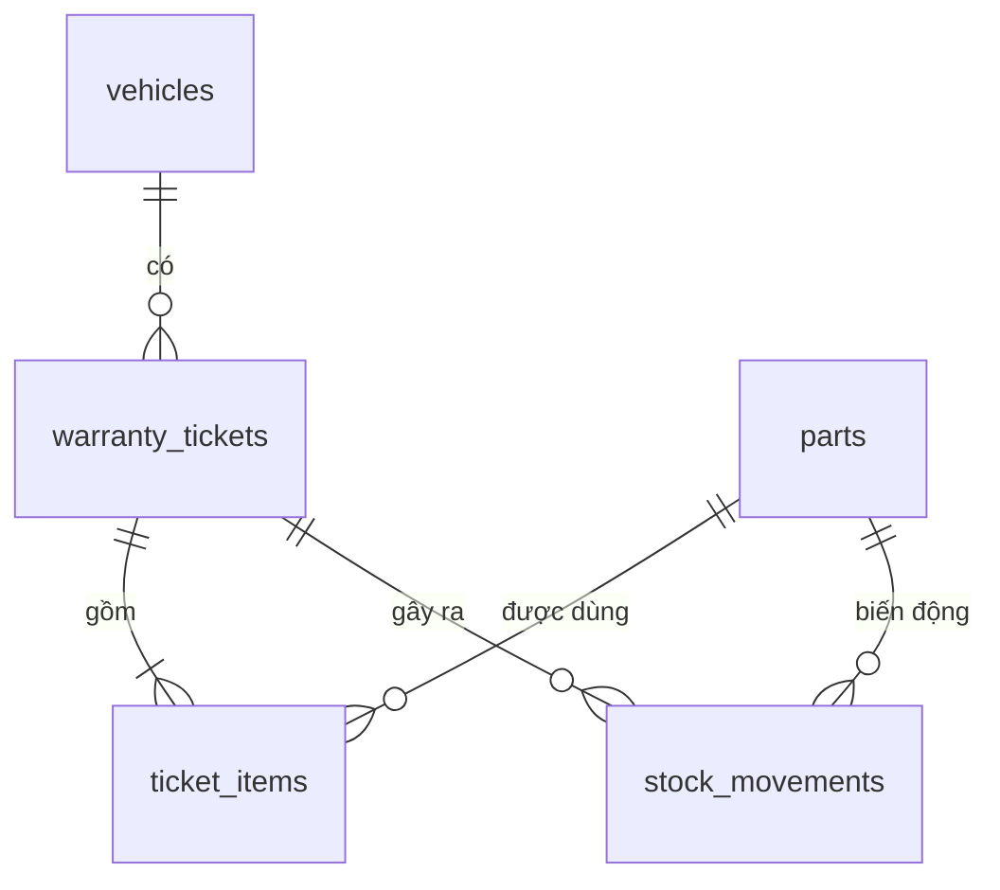

# GARA AUTO — HƯỚNG DẪN DỰNG APP CHO AI CODING AGENT

> **Bạn là ai khi đọc file này:** Senior Product Designer kiêm Senior Full-stack Engineer.
> **Nhiệm vụ:** Dựng hoàn chỉnh "Hệ thống Tra cứu & Quản lý Bảo hành Gara Sửa xe" theo đặc tả gốc
> [`gara-auto.md`](./gara-auto.md) và **toàn bộ quyết định đã chốt trong file này**.
> Khi hai file mâu thuẫn, **file này thắng**.
>
> Ngày chốt đặc tả: **2026-10-03**.

---

## 0. QUY TẮC BẮT BUỘC CHO AI

1. **Mobile-first tuyệt đối.** Admin Mobile là giao diện CHÍNH. Mọi tính năng (Dashboard, CRUD hồ sơ, CRUD kho, lịch sử kho, cài đặt, in QR, xuất Excel*) phải dùng được trên màn 375px. Desktop chỉ là layout mở rộng. (*Nút xuất Excel hiện ở Desktop, nhưng route vẫn chạy trên mobile.)
2. **Không placeholder, không TODO, không dữ liệu giả trong code production.** Dữ liệu mẫu chỉ được nằm trong `supabase/seed.sql`.
3. **Không tự gõ version package từ trí nhớ.** Luôn cài bằng `@latest` rồi xác nhận lại bằng `pnpm view <pkg> version` (xem §2).
4. **Không dùng `--force` / `--legacy-peer-deps`** để ép qua lỗi peer dependency. Gặp lỗi thì nâng version thư viện hoặc đọc docs mới nhất.
5. **Hết mỗi phase (§13) phải chạy `pnpm lint && pnpm build && pnpm test` và sửa đến khi không còn lỗi**, rồi mới sang phase sau.
6. **Ngoài phạm vi bản đầu (KHÔNG làm):** PWA/service worker/offline cache, khách quét QR bằng camera trên web, lưu ảnh thẻ, upload ảnh, đăng nhập nhiều người dùng, gửi SMS/Zalo.
7. Không dùng emoji làm icon. Chỉ dùng `lucide-react`.
8. Toàn bộ chữ trên giao diện là **tiếng Việt có dấu**. Tiền tệ hiển thị theo `vi-VN`, VND. Múi giờ nghiệp vụ là **`Asia/Ho_Chi_Minh`**.

---

## 1. QUYẾT ĐỊNH ĐÃ CHỐT

| Hạng mục | Quyết định |
|---|---|
| Frontend | **Next.js (App Router) + React + TypeScript + Tailwind CSS v4 + shadcn/ui** |
| Backend | **Supabase**: Postgres + Auth + RLS + RPC (plpgsql). Ghi dữ liệu qua **Next.js Server Actions** gọi Supabase |
| Auth | Supabase Auth **email + mật khẩu**, **chỉ 1 tài khoản admin**, **tắt đăng ký công khai**, phiên đăng nhập dài ngày |
| Deploy | **Vercel** (Next.js) + **Supabase Cloud** |
| Package manager / runtime | **pnpm** (mới nhất) + **Node.js 24 LTS** |
| Tra cứu của khách | **Chỉ bằng biển số.** Mã QR in trên tem là link `/tra-cuu/{bien-so-chuan-hoa}` (quét bằng app camera của điện thoại) |
| Tính năng thêm | Tạo & in tem QR cho từng xe · Xuất Excel (Desktop) · Lịch sử nhập/xuất kho (audit log) |
| Theme | **Dark mặc định** (navy + xanh dương/cam) + nút chuyển **Light**, tương phản cao để đọc dưới ánh sáng xưởng |
| SĐT chủ xe trên trang công khai | **Luôn che** dạng `098****123`. API công khai không bao giờ trả số đầy đủ. Nút "hiện số" chỉ hoạt động khi đang có phiên admin ("Xem như khách") |

---

## 2. TECH STACK & VERSION

### 2.1 Version tham chiếu (đã kiểm tra trên npm ngày 2026-10-03)

| Package | Version | Ghi chú |
|---|---|---|
| Node.js | **24.21.0 LTS (Krypton)** | `nvm install 24 && nvm use 24.21.0` |
| pnpm | 12.8.1 | `npm i -g pnpm@latest` |
| next | 16.3.8 | App Router, Turbopack mặc định |
| react / react-dom | 19.3.0 | |
| tailwindcss / @tailwindcss/postcss | 4.3.3 | Cấu hình bằng CSS |
| shadcn (CLI) | 4.21.1 | `pnpm dlx shadcn@latest` |
| @supabase/supabase-js | 2.117.2 | |
| @supabase/ssr | 0.12.7 | Thay thế hoàn toàn `auth-helpers` |
| supabase (CLI) | 2.119.0 | Dùng qua `pnpm dlx supabase` |
| zod | 4.6.5 | API của Zod 4 |
| react-hook-form | 7.89.0 | |
| @hookform/resolvers | 5.9.1 | Bắt buộc v5 để chạy với Zod 4 |
| qrcode.react | 4.2.0 | `QRCodeSVG` |
| exceljs | 4.4.0 | Chỉ chạy phía server |
| lucide-react | 1.51.0 | |
| sonner | 2.0.8 | Toast (cài qua shadcn) |
| vaul | 1.1.2 | Bottom sheet (shadcn `drawer`) |
| motion | 14.0.0 | Import từ `motion/react` |
| date-fns | 4.4.0 | |
| typescript | **Giữ đúng version `create-next-app` cài** | npm `latest` đã là 7.x (bản native). Chỉ nâng lên nếu `pnpm build` vẫn qua |

Cần thêm nhưng chưa kiểm tra version, phải `pnpm view` trước khi cài: `next-themes`, `@tanstack/react-table`, `vitest`.

### 2.2 Quy tắc cài package

```bash
# Xác nhận version trước khi cài
pnpm view next version
pnpm view @supabase/ssr version

# Luôn cài với @latest
pnpm add <pkg>@latest
pnpm add -D <pkg>@latest

# Sau khi cài: kiểm tra cảnh báo peer dependency, KHÔNG bỏ qua
pnpm install
pnpm outdated
```

### 2.3 Những chỗ dễ lỗi khi dùng version mới (đọc kỹ)

| Chủ đề | Đúng (bản mới) | Sai (cách cũ, KHÔNG dùng) |
|---|---|---|
| Next.js 16 middleware | File **`proxy.ts`** ở gốc, export `function proxy()` | `middleware.ts` / `export function middleware` |
| Next.js 16 params | `params: Promise<{ plate: string }>` rồi `await params` | Truy cập `params.plate` đồng bộ |
| Next.js 16 `cookies()` / `headers()` | `await cookies()` | Gọi đồng bộ |
| Tailwind v4 | `@import "tailwindcss";` + `@theme { ... }` trong `globals.css`, plugin PostCSS `@tailwindcss/postcss` | `tailwind.config.js`, `@tailwind base;`, cài `autoprefixer` |
| Tailwind v4 dark mode | `@custom-variant dark (&:where(.dark, .dark *));` (shadcn tự tạo) | `darkMode: 'class'` trong config |
| Supabase SSR | `@supabase/ssr` với `cookies.getAll/setAll` | `@supabase/auth-helpers-nextjs`, cookie `get/set/remove` |
| Supabase auth phía server | `supabase.auth.getClaims()` (hoặc `getUser()`) để xác thực | `getSession()` trên server (không an toàn) |
| Supabase key | Publishable key `sb_publishable_...` (nếu project có) | Hardcode `anon` JWT trong code |
| Zod 4 | `z.email()`, `z.string().min(1, { error: '...' })` | `z.string().email()` (deprecated), `{ message }` kiểu cũ vẫn chạy nhưng tránh dùng |
| Motion | `import { motion } from 'motion/react'` | `framer-motion` |
| shadcn form | Component `field` (nếu CLI có), nếu không thì `form` | Tự viết form wrapper |
| pnpm build scripts | pnpm chặn postinstall mặc định → chạy CLI Supabase bằng `pnpm dlx supabase ...` | `pnpm add supabase` rồi bị lỗi thiếu binary |

> Nếu CLI scaffold hoặc docs mới nhất khác bảng này, **làm theo docs chính thức mới nhất** và ghi chú lại trong `README.md`.

---

## 3. KHỞI TẠO DỰ ÁN

```bash
# 0. Runtime
nvm use 24.21.0
npm i -g pnpm@latest
node -v && pnpm -v

# 1. Scaffold. Xem flag hiện có trước
pnpm create next-app@latest --help
pnpm create next-app@latest gara-auto
#   Chọn: TypeScript ✔ · ESLint ✔ · Tailwind CSS ✔ · App Router ✔ · src/ ✘ · Turbopack ✔ · alias @/* ✔
cd gara-auto

# 2. shadcn/ui
pnpm dlx shadcn@latest init
pnpm dlx shadcn@latest add button input label textarea badge card separator skeleton \
  dialog alert-dialog drawer sheet dropdown-menu popover command select checkbox \
  table tabs toggle-group tooltip scroll-area progress avatar sonner
pnpm dlx shadcn@latest add field   # nếu không có thì: add form

# 3. Thư viện
pnpm view next-themes version && pnpm view @tanstack/react-table version
pnpm add @supabase/supabase-js@latest @supabase/ssr@latest zod@latest \
  react-hook-form@latest @hookform/resolvers@latest qrcode.react@latest exceljs@latest \
  lucide-react@latest next-themes@latest motion@latest date-fns@latest @tanstack/react-table@latest
pnpm add -D vitest@latest

# 4. Kiểm tra
pnpm lint && pnpm build
```

Thêm script vào `package.json`:

```json
{
  "scripts": {
    "test": "vitest run",
    "db:types": "pnpm dlx supabase gen types typescript --project-id $SUPABASE_PROJECT_ID --schema public > types/database.ts"
  }
}
```

---

## 4. CẤU TRÚC THƯ MỤC

```
gara-auto/
├─ app/
│  ├─ layout.tsx                 # fonts, ThemeProvider, Toaster, metadata
│  ├─ globals.css                # Tailwind v4 + design tokens (§7)
│  ├─ page.tsx                   # redirect('/tra-cuu')
│  ├─ (public)/
│  │  └─ tra-cuu/
│  │     ├─ page.tsx             # Màn A: ô tìm biển số
│  │     ├─ [plate]/page.tsx     # Màn A: Thẻ Bảo Hành Điện Tử (SSR)
│  │     └─ [plate]/not-found.tsx
│  ├─ login/page.tsx             # đăng nhập admin
│  └─ admin/
│     ├─ layout.tsx              # AdaptiveShell + TicketSheetProvider + kiểm tra admin
│     ├─ page.tsx                # Tab 1: Tổng quan (Dashboard KPI)
│     ├─ xe/page.tsx             # Tab 2: Hồ sơ xe (cards ↔ table)
│     ├─ xe/[id]/page.tsx        # Chi tiết xe + lịch sử phiếu
│     ├─ xe/[id]/qr/page.tsx     # In tem QR
│     ├─ kho/page.tsx            # Tab 3: Kho linh kiện
│     ├─ kho/lich-su/page.tsx    # Lịch sử nhập/xuất kho
│     ├─ cai-dat/page.tsx        # Thông tin gara, hotline, ngưỡng cảnh báo, đăng xuất
│     └─ export/[type]/route.ts  # Xuất Excel: vehicles | parts | movements
├─ actions/                      # Server Actions ('use server')
│  ├─ auth.ts  tickets.ts  parts.ts  settings.ts
├─ components/
│  ├─ ui/                        # shadcn (sinh tự động, sửa tối thiểu)
│  ├─ layout/                    # AdaptiveShell, BottomNav, Sidebar, AdminHeader, ThemeToggle
│  └─ domain/                    # LicensePlate, StatusBadge, WarrantyPass, VehicleCard, PartCard, ...
├─ hooks/                        # use-media-query.ts, use-haptic.ts, use-debounced-stock.ts
├─ lib/
│  ├─ supabase/{client.ts,server.ts,proxy.ts}
│  ├─ plate.ts  warranty.ts  format.ts  validations.ts  errors.ts
├─ proxy.ts
├─ supabase/
│  ├─ migrations/0001_init.sql   # §5
│  └─ seed.sql
├─ types/database.ts             # sinh bằng `pnpm db:types`
└─ tests/                        # vitest: plate, warranty, format, validations
```

---

## 5. DATABASE (Supabase / Postgres)

### 5.1 Sơ đồ



Nguyên tắc nghiệp vụ:
- **1 xe** (unique theo biển số chuẩn hóa) có **nhiều phiếu bảo hành** theo thời gian.
- Mỗi phiếu có nhiều **hạng mục phụ tùng**. Hạn từng món = `ngày kích hoạt + số tháng BH của phụ tùng`. **Hạn phiếu = hạn dài nhất** trong các món.
- **Hạn của xe** (hiển thị ở danh sách và thẻ khách) = `max(expires_on)` của tất cả phiếu.
- Tạo/sửa/xóa phiếu tự động **trừ/hoàn kho** và **ghi audit log**. Mọi thao tác này chạy trong 1 transaction (RPC).
- Xóa phụ tùng = **ẩn** (`is_active = false`) để không làm hỏng lịch sử.
- Trạng thái: `expires_on < hôm nay` → **Hết hạn** · còn `0..N` ngày (mặc định N = 30) → **Sắp hết hạn** · còn hơn N ngày → **Còn hạn**.

### 5.2 Migration `supabase/migrations/0001_init.sql`

```sql
-- ============ HELPERS ============
create or replace function public.set_updated_at() returns trigger
language plpgsql set search_path = '' as $$
begin new.updated_at := now(); return new; end $$;

create or replace function public.normalize_plate(p text) returns text
language sql immutable set search_path = '' as $$
  select upper(regexp_replace(coalesce(p, ''), '[^A-Za-z0-9]', '', 'g'))
$$;

-- ============ ADMIN ============
create table public.admin_users (
  user_id uuid primary key references auth.users(id) on delete cascade,
  created_at timestamptz not null default now()
);

create or replace function public.is_admin() returns boolean
language sql stable security definer set search_path = '' as $$
  select exists (select 1 from public.admin_users where user_id = (select auth.uid()))
$$;

-- ============ SETTINGS (1 dòng) ============
create table public.garage_settings (
  id smallint primary key default 1 check (id = 1),
  name text not null default 'Gara Auto Care',
  hotline text not null default '',
  address text,
  maps_url text,
  expiring_threshold_days int not null default 30 check (expiring_threshold_days between 1 and 180),
  low_stock_threshold int not null default 3 check (low_stock_threshold >= 0),
  updated_at timestamptz not null default now()
);
insert into public.garage_settings (id) values (1);

-- ============ PARTS ============
create table public.parts (
  id uuid primary key default gen_random_uuid(),
  sku text not null unique,
  name text not null,
  category text,
  warranty_months int not null default 6 check (warranty_months between 0 and 120),
  price bigint not null default 0 check (price >= 0),
  stock int not null default 0 check (stock >= 0),
  is_active boolean not null default true,
  created_at timestamptz not null default now(),
  updated_at timestamptz not null default now()
);
create index parts_active_name_idx on public.parts (is_active, name);

-- ============ VEHICLES ============
create table public.vehicles (
  id uuid primary key default gen_random_uuid(),
  plate text not null,
  plate_normalized text generated always as (public.normalize_plate(plate)) stored,
  plate_color text not null default 'white' check (plate_color in ('white', 'yellow')),
  model text not null,
  owner_name text,
  owner_phone text check (owner_phone is null or owner_phone ~ '^[0-9]{9,11}$'),
  odo int check (odo is null or odo >= 0),
  created_at timestamptz not null default now(),
  updated_at timestamptz not null default now(),
  constraint vehicles_plate_normalized_key unique (plate_normalized)
);

-- ============ TICKETS ============
create table public.warranty_tickets (
  id uuid primary key default gen_random_uuid(),
  vehicle_id uuid not null references public.vehicles(id) on delete cascade,
  odo int check (odo is null or odo >= 0),
  activated_on date not null default ((now() at time zone 'Asia/Ho_Chi_Minh')::date),
  expires_on date not null,
  note text,
  created_at timestamptz not null default now(),
  updated_at timestamptz not null default now()
);
create index tickets_vehicle_idx on public.warranty_tickets (vehicle_id);
create index tickets_expires_idx on public.warranty_tickets (expires_on);

create table public.ticket_items (
  id uuid primary key default gen_random_uuid(),
  ticket_id uuid not null references public.warranty_tickets(id) on delete cascade,
  part_id uuid references public.parts(id) on delete set null,
  part_name text not null,        -- snapshot tại thời điểm tạo phiếu
  part_sku text,
  serial text,                    -- tem / số seri
  quantity int not null default 1 check (quantity > 0),
  warranty_months int not null,
  expires_on date not null
);
create index ticket_items_ticket_idx on public.ticket_items (ticket_id);

-- ============ AUDIT LOG KHO ============
create table public.stock_movements (
  id bigint generated always as identity primary key,
  part_id uuid not null references public.parts(id) on delete cascade,
  delta int not null check (delta <> 0),
  stock_after int not null,
  reason text not null check (reason in ('initial','import','export','adjust','ticket_use','ticket_revert')),
  ticket_id uuid references public.warranty_tickets(id) on delete set null,
  note text,
  created_by uuid default auth.uid(),
  created_at timestamptz not null default now()
);
create index stock_movements_part_idx on public.stock_movements (part_id, created_at desc);

-- ============ TRIGGERS updated_at ============
create trigger t_parts_updated before update on public.parts for each row execute function public.set_updated_at();
create trigger t_vehicles_updated before update on public.vehicles for each row execute function public.set_updated_at();
create trigger t_tickets_updated before update on public.warranty_tickets for each row execute function public.set_updated_at();
create trigger t_settings_updated before update on public.garage_settings for each row execute function public.set_updated_at();

-- ============ VIEW DANH SÁCH XE ============
create view public.vehicle_overview with (security_invoker = true) as
select
  v.*,
  max(t.expires_on)              as expires_on,
  max(t.activated_on)            as last_activated_on,
  count(distinct t.id)::int      as ticket_count,
  coalesce(sum(i.quantity), 0)::int as item_count
from public.vehicles v
left join public.warranty_tickets t on t.vehicle_id = v.id
left join public.ticket_items i on i.ticket_id = t.id
group by v.id;

-- ============ RPC: ĐIỀU CHỈNH KHO ============
create or replace function public.adjust_stock(
  p_part_id uuid, p_delta int, p_reason text default 'adjust', p_note text default null
) returns int
language plpgsql security invoker set search_path = '' as $$
declare v_stock int;
begin
  if not public.is_admin() then raise exception 'FORBIDDEN' using errcode = '42501'; end if;
  if p_delta = 0 then raise exception 'INVALID_DELTA'; end if;
  update public.parts set stock = stock + p_delta
   where id = p_part_id and stock + p_delta >= 0
   returning stock into v_stock;
  if v_stock is null then raise exception 'INSUFFICIENT_STOCK'; end if;
  insert into public.stock_movements (part_id, delta, stock_after, reason, note)
  values (p_part_id, p_delta, v_stock, p_reason, p_note);
  return v_stock;
end $$;

-- ============ RPC: TẠO / SỬA PHIẾU (atomic) ============
-- p_vehicle: {"plate","plate_color","model","owner_name","owner_phone"}
-- p_items:   [{"part_id":"uuid","quantity":1,"serial":"..."}]
create or replace function public.save_warranty_ticket(
  p_ticket_id uuid, p_vehicle jsonb, p_odo int, p_items jsonb, p_note text default null
) returns uuid
language plpgsql security invoker set search_path = '' as $$
declare
  v_vehicle_id uuid;
  v_ticket_id uuid := p_ticket_id;
  v_today date := (now() at time zone 'Asia/Ho_Chi_Minh')::date;
  v_activated date;
  v_item jsonb;
  v_part public.parts%rowtype;
  v_qty int;
  v_exp date;
  v_max date;
  v_old record;
  v_stock int;
begin
  if not public.is_admin() then raise exception 'FORBIDDEN' using errcode = '42501'; end if;
  if jsonb_array_length(coalesce(p_items, '[]'::jsonb)) = 0 then raise exception 'ITEMS_REQUIRED'; end if;

  insert into public.vehicles (plate, plate_color, model, owner_name, owner_phone, odo)
  values (
    upper(trim(p_vehicle->>'plate')),
    coalesce(p_vehicle->>'plate_color', 'white'),
    p_vehicle->>'model',
    nullif(trim(p_vehicle->>'owner_name'), ''),
    nullif(trim(p_vehicle->>'owner_phone'), ''),
    p_odo
  )
  on conflict (plate_normalized) do update set
    plate       = excluded.plate,
    plate_color = excluded.plate_color,
    model       = excluded.model,
    owner_name  = excluded.owner_name,
    owner_phone = excluded.owner_phone,
    odo         = greatest(coalesce(public.vehicles.odo, 0), coalesce(excluded.odo, 0))
  returning id into v_vehicle_id;

  if v_ticket_id is null then
    v_activated := v_today;
    insert into public.warranty_tickets (vehicle_id, odo, activated_on, expires_on, note)
    values (v_vehicle_id, p_odo, v_activated, v_today, p_note)
    returning id into v_ticket_id;
  else
    select activated_on into v_activated from public.warranty_tickets where id = v_ticket_id for update;
    if not found then raise exception 'TICKET_NOT_FOUND'; end if;

    for v_old in
      select part_id, quantity from public.ticket_items
       where ticket_id = v_ticket_id and part_id is not null
    loop
      update public.parts set stock = stock + v_old.quantity where id = v_old.part_id
      returning stock into v_stock;
      insert into public.stock_movements (part_id, delta, stock_after, reason, ticket_id)
      values (v_old.part_id, v_old.quantity, v_stock, 'ticket_revert', v_ticket_id);
    end loop;
    delete from public.ticket_items where ticket_id = v_ticket_id;

    update public.warranty_tickets
       set vehicle_id = v_vehicle_id, odo = p_odo, note = p_note
     where id = v_ticket_id;
  end if;

  for v_item in select value from jsonb_array_elements(p_items) loop
    v_qty := greatest(coalesce((v_item->>'quantity')::int, 1), 1);

    select * into v_part from public.parts
     where id = (v_item->>'part_id')::uuid and is_active
     for update;
    if not found then raise exception 'PART_NOT_FOUND'; end if;
    if v_part.stock < v_qty then raise exception 'INSUFFICIENT_STOCK:%', v_part.sku; end if;

    v_exp := (v_activated + make_interval(months => v_part.warranty_months))::date;

    insert into public.ticket_items
      (ticket_id, part_id, part_name, part_sku, serial, quantity, warranty_months, expires_on)
    values
      (v_ticket_id, v_part.id, v_part.name, v_part.sku, nullif(trim(v_item->>'serial'), ''),
       v_qty, v_part.warranty_months, v_exp);

    update public.parts set stock = stock - v_qty where id = v_part.id returning stock into v_stock;
    insert into public.stock_movements (part_id, delta, stock_after, reason, ticket_id)
    values (v_part.id, -v_qty, v_stock, 'ticket_use', v_ticket_id);

    v_max := greatest(coalesce(v_max, v_exp), v_exp);
  end loop;

  update public.warranty_tickets set expires_on = v_max where id = v_ticket_id;
  return v_ticket_id;
end $$;

-- ============ RPC: XÓA PHIẾU (mặc định hoàn kho) ============
create or replace function public.delete_warranty_ticket(p_ticket_id uuid, p_restore_stock boolean default true)
returns void
language plpgsql security invoker set search_path = '' as $$
declare v_old record; v_stock int;
begin
  if not public.is_admin() then raise exception 'FORBIDDEN' using errcode = '42501'; end if;
  if p_restore_stock then
    for v_old in
      select part_id, quantity from public.ticket_items
       where ticket_id = p_ticket_id and part_id is not null
    loop
      update public.parts set stock = stock + v_old.quantity where id = v_old.part_id
      returning stock into v_stock;
      insert into public.stock_movements (part_id, delta, stock_after, reason, ticket_id, note)
      values (v_old.part_id, v_old.quantity, v_stock, 'ticket_revert', p_ticket_id, 'Xóa phiếu');
    end loop;
  end if;
  delete from public.warranty_tickets where id = p_ticket_id;
end $$;

-- ============ RPC CÔNG KHAI: TRA CỨU THEO BIỂN SỐ ============
create or replace function public.lookup_warranty(p_plate text) returns jsonb
language sql stable security definer set search_path = '' as $$
  select jsonb_build_object(
    'plate', v.plate,
    'plate_normalized', v.plate_normalized,
    'plate_color', v.plate_color,
    'model', v.model,
    'owner_name', v.owner_name,
    'owner_phone_masked',
      case when length(v.owner_phone) >= 7
           then left(v.owner_phone, 3) || '****' || right(v.owner_phone, 3) end,
    'odo', v.odo,
    'tickets', coalesce((
      select jsonb_agg(jsonb_build_object(
        'activated_on', t.activated_on,
        'expires_on', t.expires_on,
        'odo', t.odo,
        'items', (
          select coalesce(jsonb_agg(jsonb_build_object(
            'name', i.part_name, 'serial', i.serial, 'quantity', i.quantity,
            'expires_on', i.expires_on) order by i.expires_on desc), '[]'::jsonb)
          from public.ticket_items i where i.ticket_id = t.id)
      ) order by t.activated_on desc)
      from public.warranty_tickets t where t.vehicle_id = v.id), '[]'::jsonb)
  )
  from public.vehicles v
  where v.plate_normalized = public.normalize_plate(p_plate)
    and length(public.normalize_plate(p_plate)) >= 5
$$;

-- ============ RLS ============
alter table public.admin_users      enable row level security;
alter table public.garage_settings  enable row level security;
alter table public.parts            enable row level security;
alter table public.vehicles         enable row level security;
alter table public.warranty_tickets enable row level security;
alter table public.ticket_items     enable row level security;
alter table public.stock_movements  enable row level security;

create policy admin_users_self on public.admin_users for select to authenticated
  using (user_id = (select auth.uid()));

create policy settings_public_read on public.garage_settings for select to anon, authenticated using (true);
create policy settings_admin_write on public.garage_settings for update to authenticated
  using (public.is_admin()) with check (public.is_admin());

create policy parts_admin    on public.parts            for all to authenticated using (public.is_admin()) with check (public.is_admin());
create policy vehicles_admin on public.vehicles         for all to authenticated using (public.is_admin()) with check (public.is_admin());
create policy tickets_admin  on public.warranty_tickets for all to authenticated using (public.is_admin()) with check (public.is_admin());
create policy items_admin    on public.ticket_items     for all to authenticated using (public.is_admin()) with check (public.is_admin());
create policy moves_admin_read on public.stock_movements for select to authenticated using (public.is_admin());
create policy moves_admin_ins  on public.stock_movements for insert to authenticated with check (public.is_admin());

-- ============ QUYỀN GỌI HÀM ============
revoke execute on function public.lookup_warranty(text) from public;
grant  execute on function public.lookup_warranty(text) to anon, authenticated;

revoke execute on function public.adjust_stock(uuid, int, text, text) from public, anon;
revoke execute on function public.save_warranty_ticket(uuid, jsonb, int, jsonb, text) from public, anon;
revoke execute on function public.delete_warranty_ticket(uuid, boolean) from public, anon;
grant  execute on function public.adjust_stock(uuid, int, text, text) to authenticated;
grant  execute on function public.save_warranty_ticket(uuid, jsonb, int, jsonb, text) to authenticated;
grant  execute on function public.delete_warranty_ticket(uuid, boolean) to authenticated;
```

> **Tạo phụ tùng mới** (kể cả "thêm nhanh" trong form phiếu): Server Action insert vào `parts`, rồi nếu `stock > 0` thì ghi 1 dòng `stock_movements` với `reason='initial'`.
> **Sửa phụ tùng**: chỉ sửa tên/SKU/loại/giá/số tháng BH. Không sửa `stock` trực tiếp, mọi thay đổi tồn kho phải qua `adjust_stock`.

### 5.3 Seed `supabase/seed.sql`
Tạo 8 phụ tùng (dầu Motul 300V, bugi Denso Iridium, lọc gió K&N, gạt mưa Bosch, má phanh Brembo, ắc quy GS 65Ah, lọc nhớt Toyota, rô-tuyn 555), 4 xe đủ 3 trạng thái (còn hạn, sắp hết hạn, hết hạn) và có 1 biển vàng. **Seed qua RPC `save_warranty_ticket`** hoặc insert trực tiếp kèm `stock_movements` tương ứng.

### 5.4 Tạo tài khoản admin duy nhất
1. Supabase Dashboard → **Authentication → Sign In / Providers**: bật Email, **tắt "Allow new users to sign up"**.
2. **Authentication → Users → Add user**: nhập email + mật khẩu, tick Auto Confirm.
3. SQL Editor:
   ```sql
   insert into public.admin_users (user_id)
   select id from auth.users where email = 'chu-xuong@example.com';
   ```
4. Phiên dài ngày: để refresh token hoạt động bình thường (mặc định không hết hạn khi chưa đăng xuất). Không bật "time-box user sessions".

---

## 6. TẦNG KẾT NỐI SUPABASE TRONG NEXT.JS

### 6.1 Biến môi trường (`.env.local` và Vercel)

```bash
NEXT_PUBLIC_SUPABASE_URL=https://<project>.supabase.co
NEXT_PUBLIC_SUPABASE_PUBLISHABLE_KEY=sb_publishable_xxx   # hoặc anon key nếu project chưa có key mới
NEXT_PUBLIC_SITE_URL=https://gara-auto.vercel.app         # dùng cho link QR
SUPABASE_PROJECT_ID=<project-ref>                         # chỉ dùng cho `pnpm db:types`
# KHÔNG dùng secret/service_role key trong app. RLS + RPC là đủ.
```

### 6.2 `lib/supabase/server.ts`

```ts
import { createServerClient } from '@supabase/ssr'
import { cookies } from 'next/headers'
import type { Database } from '@/types/database'

export async function createClient() {
  const cookieStore = await cookies()
  return createServerClient<Database>(
    process.env.NEXT_PUBLIC_SUPABASE_URL!,
    process.env.NEXT_PUBLIC_SUPABASE_PUBLISHABLE_KEY!,
    {
      cookies: {
        getAll: () => cookieStore.getAll(),
        setAll: (cookiesToSet) => {
          try {
            cookiesToSet.forEach(({ name, value, options }) => cookieStore.set(name, value, options))
          } catch {
            // Gọi từ Server Component: bỏ qua, proxy.ts sẽ refresh session
          }
        },
      },
    },
  )
}
```

`lib/supabase/client.ts` dùng `createBrowserClient<Database>(url, key)`.
`lib/supabase/proxy.ts`: hàm `updateSession(request)` theo mẫu **mới nhất** trong docs Supabase "Server-Side Auth for Next.js". Hàm này refresh session, gọi `getClaims()` (hoặc `getUser()`), và redirect `/admin/*` → `/login?next=...` nếu chưa đăng nhập.

### 6.3 `proxy.ts` (gốc dự án, Next.js 16)

```ts
import type { NextRequest } from 'next/server'
import { updateSession } from '@/lib/supabase/proxy'

export async function proxy(request: NextRequest) {
  return updateSession(request)
}

export const config = { matcher: ['/admin/:path*', '/login'] }
```

**Kiểm tra nhiều lớp:** `app/admin/layout.tsx` gọi `supabase.rpc('is_admin')` phía server, nếu `false` thì `redirect('/login')`. RLS ở DB là lớp bảo vệ cuối cùng.

### 6.4 Mẫu Server Action

```ts
'use server'
import { revalidatePath } from 'next/cache'
import { createClient } from '@/lib/supabase/server'
import { ticketSchema } from '@/lib/validations'
import { toVietnameseError } from '@/lib/errors'

export type ActionResult<T = void> = { ok: true; data: T } | { ok: false; error: string }

export async function saveTicket(input: unknown): Promise<ActionResult<string>> {
  const parsed = ticketSchema.safeParse(input)
  if (!parsed.success) return { ok: false, error: parsed.error.issues[0]?.message ?? 'Dữ liệu không hợp lệ' }
  const { ticketId, vehicle, odo, items, note } = parsed.data
  const supabase = await createClient()
  const { data, error } = await supabase.rpc('save_warranty_ticket', {
    p_ticket_id: ticketId ?? null, p_vehicle: vehicle, p_odo: odo ?? null, p_items: items, p_note: note ?? null,
  })
  if (error) return { ok: false, error: toVietnameseError(error.message) }
  revalidatePath('/admin', 'layout')
  revalidatePath(`/tra-cuu/${vehicle.plateNormalized}`)
  return { ok: true, data: data as string }
}
```

`lib/errors.ts` đổi mã lỗi sang tiếng Việt: `INSUFFICIENT_STOCK` → "Không đủ tồn kho", `ITEMS_REQUIRED` → "Chọn ít nhất 1 phụ tùng", `PART_NOT_FOUND` → "Phụ tùng không còn trong kho", `FORBIDDEN` → "Phiên đăng nhập hết hạn", trùng SKU (`23505`) → "Mã phụ tùng đã tồn tại".

### 6.5 Thư viện thuần (bắt buộc có unit test)

```ts
// lib/plate.ts
export const normalizePlate = (s: string) => s.toUpperCase().replace(/[^A-Z0-9]/g, '')
// Hiển thị trong ô nhập: tự in hoa, chỉ giữ A-Z 0-9 - . (người dùng gõ "51k88999" → "51K88999")
export const sanitizePlateInput = (s: string) => s.toUpperCase().replace(/[^A-Z0-9.\-]/g, '')

// lib/warranty.ts
export type WarrantyStatus = 'active' | 'expiring' | 'expired'
export const todayVN = () =>
  new Intl.DateTimeFormat('en-CA', { timeZone: 'Asia/Ho_Chi_Minh' }).format(new Date()) // YYYY-MM-DD
export const daysLeft = (expiresOn: string, today = todayVN()) =>
  Math.round((Date.parse(expiresOn) - Date.parse(today)) / 86_400_000)
export const getStatus = (days: number, threshold = 30): WarrantyStatus =>
  days < 0 ? 'expired' : days <= threshold ? 'expiring' : 'active'
export const progressPercent = (activatedOn: string, expiresOn: string, today = todayVN()) => {
  const total = Date.parse(expiresOn) - Date.parse(activatedOn)
  const left = Date.parse(expiresOn) - Date.parse(today)
  return total <= 0 ? 0 : Math.min(100, Math.max(0, (left / total) * 100))
}

// lib/format.ts
export const formatVND = (n: number) => new Intl.NumberFormat('vi-VN', { style: 'currency', currency: 'VND' }).format(n)
export const formatDateVN = (d: string) => d.split('-').reverse().join('/')           // 2026-10-03 → 03/10/2026
export const maskPhone = (p?: string | null) => (p && p.length >= 7 ? `${p.slice(0, 3)}****${p.slice(-3)}` : '')
```

---

## 7. DESIGN SYSTEM (theo ui-ux-pro-max)

### 7.1 Định hướng
- **Phong cách:** "Industrial Dark Precision". Nền navy sâu, thẻ bo góc có viền mảnh, chữ trắng tương phản cao. Màu chỉ dùng để mang ý nghĩa (trạng thái, hành động). Biển số dập nổi là điểm nhấn thị giác duy nhất.
- **Font** (`next/font/google`, subsets `['latin','vietnamese']`):
  - `Plus_Jakarta_Sans` → `--font-sans` (UI, chữ đọc)
  - `Space_Grotesk` → `--font-plate` (biển số, mã SKU, con số KPI)
- **Kích thước:** chữ thân ≥ 16px trên input (tránh iOS tự zoom), ≥ 14px nội dung, nhỏ nhất 12px cho meta. Line-height 1.5.
- **Touch target:** ≥ **48×48px** cho mọi nút ở admin mobile. Khoảng cách giữa các nút ≥ 8px. Nút chính ở **vùng ngón cái** (nửa dưới màn hình).
- **Bo góc:** `--radius: 0.875rem` (thẻ 14px, sheet 24px, chip full).
- **Motion:** 150–250ms cho micro-interaction, 300ms cho sheet. Easing `cubic-bezier(0.16, 1, 0.3, 1)`. Đóng sheet nhanh hơn mở. Tôn trọng `prefers-reduced-motion`.

### 7.2 Tokens trong `app/globals.css`
Giữ cấu trúc shadcn sinh ra (`@import "tailwindcss"`, `@custom-variant dark`, `@theme inline`) và **thay giá trị** như sau:

```css
:root {                       /* LIGHT */
  --background: #F8FAFC;  --foreground: #0F172A;
  --card: #FFFFFF;        --card-foreground: #0F172A;
  --popover: #FFFFFF;     --popover-foreground: #0F172A;
  --primary: #1D4ED8;     --primary-foreground: #FFFFFF;
  --secondary: #E2E8F0;   --secondary-foreground: #0F172A;
  --muted: #F1F5F9;       --muted-foreground: #475569;
  --accent: #E2E8F0;      --accent-foreground: #0F172A;   /* shadcn: nền hover, KHÔNG phải màu cam */
  --destructive: #B91C1C; --destructive-foreground: #FFFFFF;
  --border: #CBD5E1;      --input: #CBD5E1;  --ring: #1D4ED8;
  --brand: #D97706;       --brand-foreground: #0F172A;    /* cam thương hiệu */
  --success: #047857;  --success-soft: #D1FAE5;
  --warning: #B45309;  --warning-soft: #FEF3C7;
  --danger:  #B91C1C;  --danger-soft:  #FEE2E2;
  --plate-white: #FFFFFF; --plate-yellow: #FACC15; --plate-ink: #0F172A;
  --radius: 0.875rem;
}
.dark {                       /* DARK (mặc định) */
  --background: #0B1120;  --foreground: #F1F5F9;
  --card: #141E33;        --card-foreground: #F1F5F9;
  --popover: #141E33;     --popover-foreground: #F1F5F9;
  --primary: #2563EB;     --primary-foreground: #FFFFFF;
  --secondary: #1E293B;   --secondary-foreground: #F1F5F9;
  --muted: #1B2742;       --muted-foreground: #94A3B8;
  --accent: #1B2742;      --accent-foreground: #F1F5F9;
  --destructive: #DC2626; --destructive-foreground: #FFFFFF;
  --border: #223254;      --input: #223254;  --ring: #3B82F6;
  --brand: #F59E0B;       --brand-foreground: #0B1120;
  --success: #34D399;  --success-soft: rgb(16 185 129 / 0.15);
  --warning: #FBBF24;  --warning-soft: rgb(245 158 11 / 0.15);
  --danger:  #F87171;  --danger-soft:  rgb(239 68 68 / 0.15);
}
@theme inline {
  /* ...các biến shadcn đã sinh... */
  --color-brand: var(--brand);       --color-brand-foreground: var(--brand-foreground);
  --color-success: var(--success);   --color-success-soft: var(--success-soft);
  --color-warning: var(--warning);   --color-warning-soft: var(--warning-soft);
  --color-danger: var(--danger);     --color-danger-soft: var(--danger-soft);
  --color-plate-white: var(--plate-white); --color-plate-yellow: var(--plate-yellow); --color-plate-ink: var(--plate-ink);
  --font-sans: var(--font-sans);     --font-plate: var(--font-plate);
}
@media (prefers-reduced-motion: reduce) {
  *, *::before, *::after { animation-duration: 0.01ms !important; transition-duration: 0.01ms !important; }
}
```

- `ThemeProvider` của `next-themes`: `attribute="class" defaultTheme="dark" enableSystem={false}`. Thêm `suppressHydrationWarning` trên `<html>`.
- **Không viết mã hex trong component.** Chỉ dùng class token (`bg-card`, `text-warning`, `bg-success-soft`, ...).
- Trạng thái **không chỉ dựa vào màu**: luôn có icon + chữ (`ShieldCheck` "Còn hạn", `Clock` "Sắp hết hạn", `ShieldAlert` "Hết hạn").

---

## 8. THƯ VIỆN COMPONENT

### 8.1 Nguyên tử (atoms, nằm trong `components/ui` hoặc mở rộng từ shadcn)
| Component | Ghi chú |
|---|---|
| `Button` | Thêm size `touch` (h-12, px-5) làm mặc định cho admin mobile. Variant `brand` |
| `Input` | `text-base` (16px). `inputMode="numeric"` cho ODO/SĐT/giá/số lượng |
| `Badge` / `StatusBadge` | `status: WarrantyStatus`, `days?: number` → icon + chữ + màu token |
| `Chip` / `FilterChips` | Dùng `ToggleGroup`, cuộn ngang, có đếm số lượng |
| `Skeleton` | Mọi danh sách có trạng thái loading |
| `EmptyState` | Icon + câu mô tả + nút hành động |

### 8.2 Domain (`components/domain`)
| Component | Props chính | Dùng ở |
|---|---|---|
| `LicensePlate` | `plate`, `color: 'white'\|'yellow'`, `size: 'sm'\|'md'\|'lg'` | A, B, C, tem QR |
| `WarrantyProgress` | `activatedOn`, `expiresOn`, `threshold` | A, chi tiết xe |
| `WarrantyPass` | `data: LookupResult`, `canRevealPhone` | A |
| `PartLineItem` | `name, serial, quantity, activatedOn, expiresOn` | A, chi tiết xe |
| `MaskedPhone` | `masked`, `full?`, `canReveal` | A |
| `KpiCard` | `icon, label, value, tone, href` | Dashboard |
| `ExpiringList` | danh sách xe sắp hết hạn + nút `tel:` | Dashboard |
| `VehicleCard` | `vehicle: VehicleOverview` + `DropdownMenu` (Xem / Sửa / In QR / Xóa) | B |
| `PartCard` | `part` + `QtyStepper` + menu (Sửa / Xóa) | B |
| `QtyStepper` | `value`, `onCommit(delta)`, debounce 400ms, nhấn giữ để lặp | B, C |
| `TicketForm` | Tạo/sửa phiếu, RHF + Zod, chọn nhiều phụ tùng (`Command` + checklist), số lượng và seri từng món | B, C |
| `PartForm` | Thêm/sửa phụ tùng | B, C |
| `ConfirmDialog` | `AlertDialog` cho mọi thao tác xóa | B, C |
| `StockMovementList` | Mobile: timeline · Desktop: table | Lịch sử kho |
| `QrLabel` | `QRCodeSVG` + biển số + tên gara + hotline, CSS in | In QR |

### 8.3 Adaptive (tái sử dụng Mobile ↔ Desktop)
| Component | Mobile (< 1024px) | Desktop (≥ 1024px) |
|---|---|---|
| `AdaptiveShell` | Header + **BottomNav** cố định đáy | **Sidebar** cố định trái + Topbar |
| `ResponsiveSheet` | shadcn `Drawer` (vaul) trượt từ dưới, có tay kéo | shadcn `Sheet side="right"` (drawer phải, rộng 480px) hoặc `Dialog` |
| `VehicleCollection` | Danh sách `VehicleCard` | `DataTable` (TanStack): sort, phân trang 20 dòng, chọn cột |
| `PartCollection` | Danh sách `PartCard` | `DataTable` với `QtyStepper` inline |

`hooks/use-media-query.ts` dùng `useSyncExternalStore` + `matchMedia('(min-width: 1024px)')`. Server render mặc định là layout mobile.

**Quy tắc:** logic dữ liệu (fetch, action, schema) **dùng chung**, chỉ phần trình bày khác nhau. Không nhân đôi form.

---

## 9. ĐẶC TẢ MÀN HÌNH

### Màn A — Khách tra cứu (`/tra-cuu`, `/tra-cuu/[plate]`), không cần đăng nhập
1. **Header:** logo + tên gara (từ `garage_settings`), nút đỏ **Hotline** `tel:` ghim bên phải.
2. **Search block:** ô biển số cỡ lớn (font plate, 20px, `autoCapitalize="characters"`, `autoComplete="off"`, tự in hoa và bỏ ký tự đặc biệt khi gõ). Nút "Tra cứu" → `router.push('/tra-cuu/' + normalizePlate(v))`. Validate tối thiểu 5 ký tự.
3. **`/tra-cuu/[plate]`** là Server Component: `await params` → `supabase.rpc('lookup_warranty', { p_plate })`. Không có kết quả → `notFound()` (trang thân thiện: "Chưa có hồ sơ cho biển số này" + nút gọi gara).
4. **WarrantyPass:**
   - `LicensePlate` dập nổi (nền trắng/vàng, viền đen bo góc, 4 ốc ở góc, đổ bóng trong).
   - Tên xe, ODO, ngày kích hoạt gần nhất.
   - `StatusBadge` theo **hạn của xe** (hạn dài nhất).
   - `WarrantyProgress`: "Còn X ngày", thanh tiến độ, ngày bắt đầu và ngày kết thúc.
   - Chủ xe + `MaskedPhone` (`098****123`). Nút con mắt chỉ hiện khi đang có phiên admin.
5. **Danh sách phụ tùng:** nhóm theo phiếu (mới nhất trước). Mỗi món hiển thị tên, tem/seri, số lượng, ngày kích hoạt, ngày hết hạn, badge "Còn N ngày / Hết hạn".
6. **Sticky action bar** (đáy, chừa `env(safe-area-inset-bottom)`): **Gọi gara** (`tel:`) · **Chỉ đường** (`maps_url`, mở tab mới).
7. SEO: `generateMetadata` → title "Bảo hành xe {plate} | {tên gara}", `robots: { index: false }` cho trang `[plate]`.

### Màn B — Admin Mobile (`/admin/*`), giao diện CHÍNH
**Header:** tên gara · badge phiên ("Đang làm việc" + chấm xanh nhấp nháy) · `ThemeToggle` · nút ⚙ → `/admin/cai-dat`.

**BottomNav** (5 vị trí, cao 64px + safe-area):
`[Tổng quan]` `[Hồ sơ xe]` **`[ + Tạo phiếu ]`** (FAB tròn 56px, nổi lên giữa, màu primary, có bóng) `[Kho hàng]` `[Lịch sử kho]`

- **Tab 1 – Tổng quan:** lưới 2×2 `KpiCard`: Tổng xe còn bảo hành · **Sắp hết hạn ≤ N ngày** (bấm → `/admin/xe?status=expiring`) · **Phụ tùng sắp hết hàng** (`stock ≤ low_stock_threshold`, bấm → `/admin/kho?filter=low`) · Phiếu tạo trong tháng. Bên dưới là `ExpiringList`: biển số, tên khách, còn X ngày, nút **Gọi** (`tel:`) to.
- **Tab 2 – Hồ sơ xe:** ô tìm (biển số / tên / SĐT, debounce 300ms, lưu vào `?q=`) + chips `Tất cả · Còn hạn · Sắp hết · Hết hạn` (lưu vào `?status=`). Danh sách `VehicleCard`: biển số nổi bật, dòng xe, chủ xe, hạn, badge. Menu: **Xem chi tiết** · **Sửa phiếu gần nhất** · **In tem QR** · **Xem như khách** · **Xóa** (ConfirmDialog có checkbox "Hoàn lại tồn kho", mặc định bật).
  - `/admin/xe/[id]`: thông tin xe, danh sách các phiếu (sửa/xóa từng phiếu), nút "Tạo phiếu mới cho xe này" (điền sẵn thông tin xe).
- **Tab 3 – Kho hàng:** ô tìm + chips loại phụ tùng + chip "Sắp hết" + nút **+ Thêm phụ tùng**. `PartCard`: tên, SKU, BH N tháng, đơn giá, `QtyStepper [-] n [+]` ngay trên thẻ (cảnh báo màu warning khi thấp). Chạm thẻ → sheet sửa. Vuốt trái → hiện nút Xóa → ConfirmDialog.
- **Lịch sử kho:** timeline nhóm theo ngày: `+5 Nhập kho`, `-1 Dùng cho phiếu 51K-889.99`, tồn sau, ghi chú. Lọc theo phụ tùng và lý do.
- **Form Tạo/Sửa phiếu** (`ResponsiveSheet`, mở từ FAB ở mọi tab qua `TicketSheetProvider`, hỗ trợ deep link `?tao-phieu=1`):
  1. Biển số (font plate, tự in hoa) + chọn màu biển trắng/vàng. Khi biển số đã tồn tại (tra khi blur) → tự điền dòng xe, chủ xe, SĐT, ODO cũ.
  2. Dòng xe · Chủ xe · SĐT (`inputMode="tel"`) · ODO (`inputMode="numeric"`, không nhỏ hơn ODO cũ thì cảnh báo).
  3. **Chọn phụ tùng:** ô tìm + checklist/chips nhiều lựa chọn từ kho (hiện tồn kho, món hết hàng thì disable). Mỗi món đã chọn có stepper số lượng + ô seri. Nút **"+ Phụ tùng mới"** mở `PartForm` chồng lên, lưu xong tự chọn món đó.
  4. Tóm tắt: "Hạn bảo hành đến **dd/mm/yyyy** (dài nhất)".
  5. Nút chính **"Kích hoạt bảo hành"** (sticky đáy sheet, h-12). Thành công → toast + rung nhẹ + mở dialog "In tem QR ngay?".
- **Cài đặt:** sửa tên gara, hotline, địa chỉ, link Google Maps, ngưỡng sắp hết hạn, ngưỡng tồn kho thấp. Nút đăng xuất.

### Màn C — Admin Desktop (≥ 1024px), cùng route với B
- `Sidebar` trái 256px: các mục giống BottomNav + Cài đặt + nút "Tạo phiếu" nổi bật ở đầu.
- Hồ sơ xe và Kho dùng **DataTable**: sort theo cột, phân trang, ô tìm, lọc trạng thái, action mỗi dòng, nút **Xuất Excel**.
- Form mở bằng **Sheet bên phải**, cùng component `TicketForm` / `PartForm`.
- Dashboard: KPI 4 cột + bảng xe sắp hết hạn + bảng phụ tùng sắp hết hàng.
- **CRUD giữ nguyên 1:1 với mobile.**

---

## 10. LUỒNG NGƯỜI DÙNG

```mermaid
flowchart TD
  subgraph Khách
    K1[Quét QR trên tem bằng camera điện thoại] --> K3
    K2[Vào web, gõ biển số] --> K3[/tra-cuu/BIENSO]
    K3 -->|Có hồ sơ| K4[Thẻ bảo hành: trạng thái, đếm ngược, phụ tùng]
    K3 -->|Không có| K5[Trang không tìm thấy + nút gọi gara]
    K4 --> K6[Gọi gara / Chỉ đường]
  end
  subgraph KTV
    A0[/login/] --> A1[Tổng quan]
    A1 -->|FAB +| T1[Sheet tạo phiếu]
    T1 --> T2[Biển số → tự điền nếu xe cũ]
    T2 --> T3[Chọn phụ tùng / thêm nhanh phụ tùng mới]
    T3 --> T4[Kích hoạt → RPC trừ kho + ghi log + tính hạn]
    T4 --> T5[Toast + hỏi in tem QR]
    A1 --> D1[Bấm KPI Sắp hết hạn] --> D2[Danh sách đã lọc] --> D3[Gọi khách]
    A1 --> S1[Kho] --> S2[+/- tồn kho] --> S3[adjust_stock + log]
  end
```

**Trạng thái UI bắt buộc cho mọi màn:** loading (Skeleton) · rỗng (EmptyState) · lỗi (thông báo tiếng Việt + nút thử lại) · thành công (toast) · đang gửi (nút disabled + spinner, chặn bấm 2 lần).

---

## 11. QR & XUẤT EXCEL

### 11.1 Tem QR (`/admin/xe/[id]/qr`)
- `QRCodeSVG` với `value={`${process.env.NEXT_PUBLIC_SITE_URL}/tra-cuu/${plate_normalized}`}`, `level="M"`, `marginSize={2}`.
- Tem 60×40mm: QR bên trái; bên phải là biển số (font plate), tên gara, hotline, dòng "Quét để xem bảo hành".
- Chọn số tem cần in (1–12, xếp lưới trên A4). Nút **In** → `window.print()`. Dùng `@media print` để ẩn mọi phần trừ tem, `@page { margin: 8mm }`.

### 11.2 Excel (`app/admin/export/[type]/route.ts`)
- `export const runtime = 'nodejs'`. Kiểm tra admin trước khi xử lý (trả 401 nếu không phải admin).
- `type ∈ vehicles | parts | movements`. Tạo `ExcelJS.Workbook`, header in đậm, freeze dòng đầu, độ rộng cột hợp lý, định dạng ngày `dd/mm/yyyy` và tiền `#,##0 "₫"`.
- Trả về `new Response(buffer, { headers: { 'Content-Type': 'application/vnd.openxmlformats-officedocument.spreadsheetml.sheet', 'Content-Disposition': 'attachment; filename="gara-xe-2026-10-03.xlsx"' } })`.
- Áp dụng bộ lọc hiện tại qua query string (`?status=expiring&q=...`).

---

## 12. MICRO-INTERACTIONS (môi trường xưởng)

| Tương tác | Cách làm |
|---|---|
| Rung phản hồi | `hooks/use-haptic.ts`: `navigator.vibrate?.(10)` khi bấm +/-, `[15,40,15]` khi kích hoạt thành công, `40` khi lỗi. Kiểm tra hỗ trợ (iOS Safari không có, bỏ qua im lặng) |
| QtyStepper | Cập nhật lạc quan bằng `useOptimistic`, gộp các lần bấm trong 400ms thành 1 lần gọi `adjust_stock` (delta > 0 → `import`, < 0 → `export`). Lỗi → hoàn số cũ + toast. Nhấn giữ 400ms → lặp mỗi 100ms. Số đổi có hiệu ứng trượt dọc |
| Vuốt xóa | `motion` `drag="x"` trên `PartCard`/`VehicleCard`, vuốt quá 80px → hiện nút Xóa đỏ. Luôn có cách thay thế không cần vuốt (menu ⋮) |
| Badge pulse | KPI "Sắp hết hạn" > 0 và chấm phiên làm việc: vòng sáng nhấp nháy 2s. Tắt khi `prefers-reduced-motion` |
| Sheet | Kéo xuống để đóng (vaul), backdrop mờ. Hỏi xác nhận khi đóng form có thay đổi chưa lưu |
| Nút | `active:scale-[0.97]`, transition 150ms, focus ring 2px `ring` luôn hiện khi dùng bàn phím |
| Thành công | Toast sonner góc dưới (mobile: phía trên BottomNav) + icon check có animation vẽ nét |
| Chuyển tab | Fade + trượt 4px, 200ms |

---

## 13. KẾ HOẠCH THEO PHASE

| Phase | Nội dung | Hoàn thành khi |
|---|---|---|
| 0 | Runtime, scaffold, shadcn, thư viện (§3) | `pnpm build` qua, trang mặc định chạy |
| 1 | Design tokens, fonts, ThemeProvider, `LicensePlate`, `StatusBadge`, `WarrantyProgress`, trang `/dev/ui` (chỉ bật ở dev) để xem component | Dark/Light chuẩn, tương phản đạt AA |
| 2 | Migration §5, seed, tạo admin, `pnpm db:types`, client Supabase, `proxy.ts`, `/login`, `lib/*` + unit test | Đăng nhập được, anon không đọc được bảng, `lookup_warranty` chạy |
| 3 | Màn A đầy đủ | Tra cứu 4 xe seed hiển thị đúng 3 trạng thái, SĐT luôn bị che |
| 4 | `AdaptiveShell`, BottomNav/Sidebar, Dashboard | KPI đúng với seed, bấm KPI lọc đúng |
| 5 | Hồ sơ xe + `TicketForm` + chi tiết xe | Tạo/sửa/xóa phiếu làm thay đổi tồn kho và log chính xác |
| 6 | Kho + `QtyStepper` + `PartForm` + Lịch sử kho | +/- liên tục 10 lần chỉ tạo ít log nhờ gộp, tồn kho không âm |
| 7 | DataTable desktop, Excel, In QR, Cài đặt | File xlsx mở được trong Excel, tem in đúng kích thước |
| 8 | Micro-interactions, a11y, rà responsive, README, deploy | Checklist §15 đạt 100% |

---

## 14. DEPLOY

1. Supabase Cloud: tạo project (region Singapore), chạy migration (`pnpm dlx supabase link` → `pnpm dlx supabase db push`, hoặc dán SQL vào SQL Editor), chạy seed nếu cần, tạo admin (§5.4).
2. Auth → URL Configuration: `Site URL = NEXT_PUBLIC_SITE_URL`, thêm `http://localhost:3000` vào Redirect URLs.
3. Vercel: import repo, Framework = Next.js, Node.js 24.x, Install command `pnpm install`, thêm env §6.1 cho cả Production và Preview.
4. Sau deploy: tra cứu thử 1 biển số, đăng nhập admin, tạo phiếu, in QR, quét QR bằng điện thoại thật.

---

## 15. CHECKLIST NGHIỆM THU

**Chức năng**
- [ ] Khách tra cứu bằng biển số (gõ có dấu chấm, gạch, chữ thường đều ra cùng 1 xe) và bằng link QR
- [ ] Badge 3 trạng thái đúng ngưỡng; đếm ngược tính theo giờ Việt Nam
- [ ] SĐT trên trang công khai luôn bị che; response của `lookup_warranty` không chứa số đầy đủ
- [ ] Tạo phiếu: hạn = hạn dài nhất, tồn kho trừ đúng, có log `ticket_use`
- [ ] Sửa phiếu: hoàn kho cũ + trừ kho mới đúng; Xóa phiếu: hoàn kho khi tick chọn
- [ ] CRUD phụ tùng, thêm nhanh trong form phiếu, +/- tồn kho không bao giờ âm
- [ ] Lịch sử kho đầy đủ, lọc được; Xuất Excel 3 loại; In tem QR
- [ ] Không đăng nhập thì không vào được `/admin`; tài khoản không có trong `admin_users` không đọc/ghi được gì

**UX / UI**
- [ ] Mọi tính năng dùng được ở 375px; không có thanh cuộn ngang ở 375 / 768 / 1024 / 1440
- [ ] Touch target ≥ 48px; nút chính ở vùng ngón cái; input ≥ 16px
- [ ] Dark/Light đều đạt tương phản ≥ 4.5:1 cho chữ; trạng thái có icon + chữ
- [ ] Đủ trạng thái loading / rỗng / lỗi / thành công cho mọi danh sách và form
- [ ] Focus ring nhìn thấy được; mọi nút chỉ có icon đều có `aria-label`; sheet/dialog giữ focus bên trong
- [ ] `prefers-reduced-motion` tắt các animation lặp
- [ ] Safe area iOS cho BottomNav và sticky action bar

**Kỹ thuật**
- [ ] `pnpm lint && pnpm build && pnpm test` không lỗi, không cảnh báo peer dependency chưa xử lý
- [ ] Không có secret key ở client; `.env.local` nằm trong `.gitignore`; có `.env.example`
- [ ] `README.md` ghi version thực tế đã cài, lệnh chạy, cách tạo admin, cách deploy
